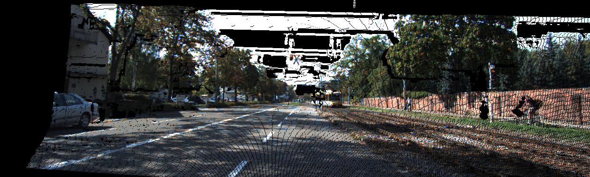
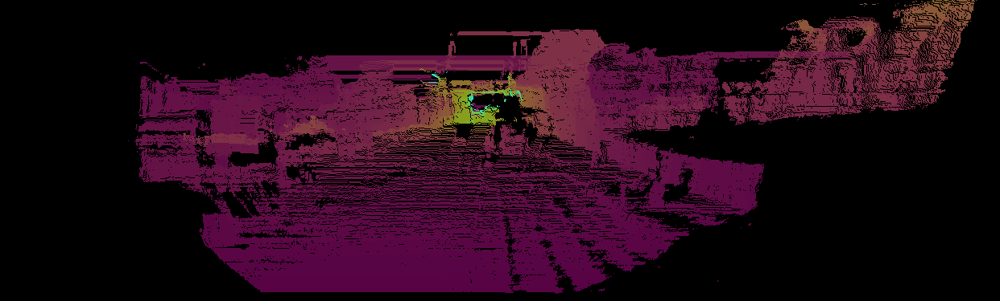

# Stereo Matching

**Keywords** : Semi-Global Matching, StereoSGBM_create

<p float="left">
  
  
</p>

### Requirements
* Python 3.6.4
* Numpy
* OpenCV

### Usage
- Show teaser image in 3D



```python
python test.py img/rgb_2011_09_26_0001_02_0070.png img/rgb_2011_09_26_0001_03_0070.png
```

- Show disparity map


```python
python test.py img/rgb_2011_09_26_0001_02_0070.png img/rgb_2011_09_26_0001_03_0070.png --show_disp_map
```

- Show depth map



```python
python test.py img/rgb_2011_09_26_0001_02_0070.png img/rgb_2011_09_26_0001_03_0070.png --show_depth_map
```

